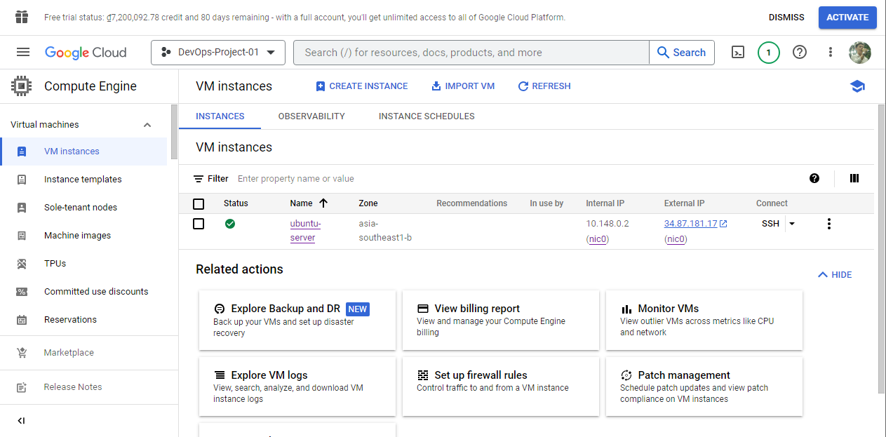
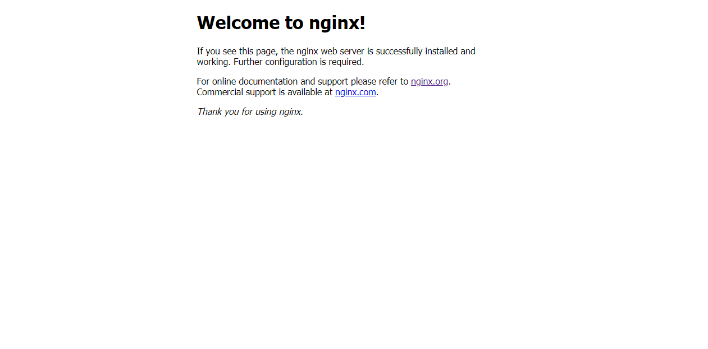
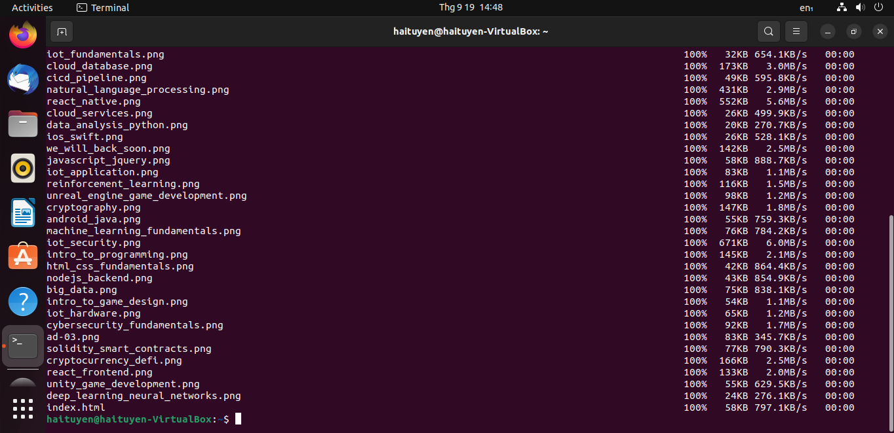

# Setup A Static Website Using Niginx Project

This project marks my inaugural self-guided DevOps project, encompassing a step-by-step process for establishing a website. The project entails:

- Setting up an Ubuntu Server.
- Accessing the server securely via SSH protocol and configuring the server.
- Initiating firewall rules for enhanced security.
- Installing and deploying Nginx as a web server.
- Transferring website files (including .html, .css, .js, etc.) to the Nginx /var/www/ directory using SCP (Secure Copy Protocol).
- Registering a DNS (Domain Name System) account and associating the server's external IP address with a domain name.
- Leveraging Nginx's Server Block feature to host multiple websites on a single IP address.
- Accquiring a Let's Encrypt certificate to enable SSL encrytion for the hosted websites.

This project serves as an educational exercise, covering various aspects of web hosting and server management within a DevOps context.

## Setting up a ubuntu server

The purpose of this step is to deploy a Virtual Machine on a cloud platform, and in this project, Google Cloud is utilized. Following that, we will set up the Ubuntu Server operating system on this virtual machine.



## Accessing the server securely via SSH protocol and configuring the server

### Accessing the server

To accessing the server, there are several ways:

* using [SSH-in-Browser](https://cloud.google.com/compute/docs/ssh-in-browser) from the Google Cloud console.
* using SSH by running the [`gcloud compute ssh` command](https://cloud.google.com/sdk/gcloud/reference/compute/ssh).
* using SSH from an OpenSSH client (I prefer this way).
* using SSH from the Windows PuTTY app (If your operating system is Window).

Since my computer is currently running Ubuntu (22.04.3 LTS), which supports SSH connections natively, we only need to generate an SSH key pair (public key, private key) with the following command:

```plaintext
ssh-keygen -t rsa
```

Keep the private key on your computer and insert the public key into the Virtual machine you created in the previous step.

Now, access the server using the following command:

```
ssh <server_external_IP>
```

During the first-time connection, you might receive a warning, but don't worry; simply type 'yes'. Afterward, you should be able to connect to the server succesfully.

### Configuring the server

Next, it's essential to create a new user that have many administrative privileges to facilitate various tasks while minimizing security risk. This user is commonly referred to as a non-root user.

Here's how you can create a non-root user:

First, use the following command to add a new user, replacing `<username>` with your chosen username:

```php
sudo adduser <username>
```

After adding the new user, exit the current SSH connection session:

```plaintext
exit
```

Reconnect to the server using the new username and the server's external Ip address:

```plaintext
ssh <new_username>@<server_external_IP>
```

## Initializing firewall rules for enhanced security.

To implement restricted access to specific services on our server, we can employ the UFW (Uncomplicated Firewall) to manage and control access. In this context, we will configure UFW to permit access to OpenSSH, which is the service we utilize for connecting to the server.

To identify the services that have their profiles registered with UFW, we can execute the following command:

```
sudo ufw app list
```

To instruct the firewall to allow SSH connections, use the following command:

```
sudo ufw allow OpenSSH
```

Once OpenSSH access has been granted, we can activate the firewall using the enable command:

```
sudo ufw enable
```

When prompted, confirm the action by entering `y` to complete the process. To check the current status of the firewall, you can use the following command:

```
sudo ufw status
```

## Installing and deploying Nginx as a web server.

To begin the installation of Nginx using the `apt` package manager, it's essential to refresh the local package cache by checking the configured software repositories for any updates or new packages. To perform this update, use this following command:

```
sudo apt update
```

Afterward, install Nginx by a single command using `apt` package:

```bash
sudo apt install nginx
```

Once the process of installing Nginx complete, configure the firewall again to enable Ngix service in the firewall configuration.

Let's see the list of available application that have their profiles registerd with UFW

```
sudo ufw app list
```

Enable the option "Nginx Full" by the following command. The firewall will enable traffic through port `:80` and `:443` immediately

```
sudo ufw allow 'Nginx Full'
```

To manage Nginx service, use following commands:

```
// Start (activate)
sudo systemctl start nginx

// Restart (Start or restart)
sudo systemctl restart nginx

// Stop (deactivate)
sudo systemctl stop nginx

// Reload (without losing connection)
sudo systemctl reload nginx

// Enable Nginx service so that it starts automatically at boot time
sudo systemctl enable nginx

// Disable Nginx service, preventing it from starting automatically at boot time
sudo systemctl disable nginx
```

To see the status of Nginx service, use the following command:

```
systemctl status nginx
```

Now, open your browser and enter the external IP of your server. If you see something like this, congratulation!



## Transferring website files to the Nginx directory using SCP.

Okay, now you need to use the SCP protocol to copy website files from your computer to the `/var/www/html/` directory on server. Nginx serves its contents from this directory by default. When you use the `tree` command in this directory, you will see a file with name ` index.nginx-debian.html ` which have the content you saw in the previous step.

Now, copy all files in the `website_files` directory into the `/var/www/html/` directory using SCP protocol.

```
scp -r ~/<local_address>/* <username>@<server_external_ip>:/var/www/html/
```

If you encounter a "permission denied" error during the SCP transfer, you may need to adjust the ownership and permissions of the `/var/www/html/` directory on the server.

```
// Change ownership of this directory to the non-root user
sudo chown <username>:username> /var/www/html/

// Change files permission of this directory
sudo chmod 777 <remote_folder>

```

After adjusting the ownership and permissions, try transferring the website files again using SCP protocol:

```
scp -r ~/<local_address>/* <username>@<server_external_ip>:/var/www/html/
```

If you see something like this, the website files should be successfully copied:



Now, enter the external IP address of server, you will see the website content


## Associating the server's external IP address with a domain name

To link a domain name to your server's IP address, follow these steps:

1. Buy a domain from a domain provider.
3. Access the domain provider's website and log in to your account.
4. In the domain management or DNS settings section, add an A record that maps your domain to your server's IP address.

By completing these steps, you'll have successfully associated your domain name with your server's IP address, allowing visitors to access your server using the domain name you've purchased.

In this project, I bought as domain name: **devopsroject.top**


## Host multiple websites on a single IP address.

Nginx can host more than one domain on the same web server by using server blocks. To make a new server block, create a new directory for our content in  `/var/www/` .

Create a new directory using `mkdir` (make directories) command with `-p` flag (create parent directories)

```
cd /var/www
sudo mkdir -p devopsproject.top/html
```

Duplicate the default configuration file and names the new configuration file as `devopsproject.top`. All the configuration files locate in the `/etc/nginx/sites-available/` directory

```
sudo cp /etc/nginx/sites-available/default /etc/nginx/sites-available/devopsproject.top
```

Now, use nano to edit new configuration file in the `/etc/nginx/sites-available/` directory. 

```
sudo nano /etc/nginx/sites-available/devopsproject.top
```

Copy the content of `devopsproject.top.txt` file in this repository and paste into the current nano editor.

Finally, to enable this server block, we need to create a symlink (symbolic link) of new configuration file and store it in the `/etc/nginx/sites-enabled` directory. 

```
sudo ln -s /etc/nginx/sites-available/devopsproject.top /etc/nginx/sites-enabled/
```

Then, use SCP to copy website files into the new directory: `/var/www/devopsproject/html/`

## Accquiring a Let's Encrypt certificate to enable SSL encrytion for the hosted websites.

Follow the instruction of [this site](https://www.digitalocean.com/community/tutorials/how-to-secure-nginx-with-let-s-encrypt-on-ubuntu-20-04#step-2-confirming-nginx-s-configuration), they will help you get a free SSL certificate for your website.
