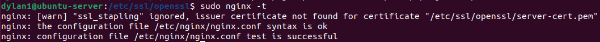

# Setup A Static Website Using Niginx

This project marks my inaugural self-guided DevOps project, encompassing a step-by-step process for establishing a website. The project entails:

1. [Setting up an Ubuntu Server](https://github.com/HaiTuyen/Devops-projects-for-self-study/tree/main/Setup%20A%20Static%20Website%20Using%20Nginx#setting-up-a-ubuntu-server).
2. [Accessing the server securely via SSH protocol and configuring the server](https://github.com/HaiTuyen/Devops-projects-for-self-study/tree/main/Setup%20A%20Static%20Website%20Using%20Nginx#accessing-the-server-securely-via-ssh-protocol-and-configuring-the-server).
3. [Initiating firewall rules for enhanced security](https://github.com/HaiTuyen/Devops-projects-for-self-study/tree/main/Setup%20A%20Static%20Website%20Using%20Nginx#initializing-firewall-rules-for-enhanced-security).
4. [Installing and deploying Nginx as a web server](https://github.com/HaiTuyen/Devops-projects-for-self-study/tree/main/Setup%20A%20Static%20Website%20Using%20Nginx#installing-and-deploying-nginx-as-a-web-server).
5. [Transferring website files (including .html, .css, .js, etc.) to the Nginx /var/www/ directory using SCP (Secure Copy Protocol)](https://github.com/HaiTuyen/Devops-projects-for-self-study/tree/main/Setup%20A%20Static%20Website%20Using%20Nginx#transferring-website-files-to-the-nginx-directory-using-scp).
6. [Registering a DNS (Domain Name System) account and associating the server&#39;s external IP address with a domain name](https://github.com/HaiTuyen/Devops-projects-for-self-study/tree/main/Setup%20A%20Static%20Website%20Using%20Nginx#registering-a-dns-domain-name-system-account-and-associating-the-servers-external-ip-address-with-a-domain-name).
7. [Leveraging Nginx&#39;s Server Block feature to host multiple websites on a single IP address](https://github.com/HaiTuyen/Devops-projects-for-self-study/tree/main/Setup%20A%20Static%20Website%20Using%20Nginx#leveraging-nginxs-server-block-feature-to-host-multiple-websites-on-a-single-ip-address).
8. [Accquiring a Let&#39;s Encrypt certificate to enable SSL encrytion for the hosted websites](https://github.com/HaiTuyen/Devops-projects-for-self-study/tree/main/Setup%20A%20Static%20Website%20Using%20Nginx#accquiring-a-lets-encrypt-certificate-to-enable-ssl-encrytion-for-the-hosted-websites).
9. [Using self-signed SSL/TLS certificate instead.](https://github.com/HaiTuyen/Devops-projects-for-self-study/tree/main/Setup%20A%20Static%20Website%20Using%20Nginx#using-self-signed-ssltls-certificate-instead)

This project serves as an educational exercise, covering various aspects of web hosting and server management within a DevOps context.

## Setting up a ubuntu server

The purpose of this step is to deploy a Virtual Machine on a cloud platform, and in this project, Google Cloud is utilized. Following that, we will set up the Ubuntu Server operating system on this virtual machine.


## Accessing the server securely via SSH protocol and configuring the server

### Accessing the server

To accessing the server, there are several ways:

* using [SSH-in-Browser](https://cloud.google.com/compute/docs/ssh-in-browser) from the Google Cloud console.
* using SSH by running the [`gcloud compute ssh` command](https://cloud.google.com/sdk/gcloud/reference/compute/ssh).
* using SSH from an OpenSSH client (I prefer this way).
* using SSH from the Windows PuTTY app (If your operating system is Window).

Since my computer is currently running Ubuntu (22.04.3 LTS), which supports SSH connections natively, we only need to generate an SSH key pair (public key, private key) with the following command:

```plaintext
ssh-keygen -t rsa
```

Keep the private key on your computer and insert the public key into the Virtual machine you created in the previous step.

Now, access the server using the following command:

```
ssh <server_external_IP>
```

During the first-time connection, you might receive a warning, but don't worry; simply type 'yes'. Afterward, you should be able to connect to the server succesfully.

### Configuring the server

To increase the security and usability of your server and make a solid foundation for subsequent actions, you must follow some configuration steps:

**Step 1:** Log in server using SSH protocol:

```
ssh <server_external_IP>
```

**Step 2:** Create a non-root user

```
sudo adduser dylan1
```

* `u1` is new username I want to create.

> It is highly recommended to create a non-root user when configuring an Debian server, and in fact, it's considered a best practice for security reasons. When you initially set up an Debian server, it often comes with a default user named "root" with full administrative privileges. However, using the root account for everyday tasks can pose security risks.

**Step 3:** Grant administrative privileges to new user

```
sudo usermod -aG sudo dylan1
```

* `sudo`: This is a command used to execute another command with superuser (root) privileges. It is often required for administrative tasks.
* `usermod`: This is a command used to modify user account properties.
* `-aG sudo`: These are options passed to the `usermod` command:
  * `-a`: It stands for "**append**" and is used to add the user to the specified group without removing them from any other groups.
  * `-G sudo`: This specifies the group to which you want to add the user. In this case, you are adding the user to the "sudo" group.
* `u1`: This is the username of the user you want to add to the "sudo" group.

To display the groups to which an username belongs on a Linux system, use the following command:

```
group <username>
```

**Step 4:** To avoid the need to switch users every ssh connect session, it is advisable to access the server directly as a new user intead of root. Please follow these commands (Using SSH keys methods for accessing) to achive this:

```
# Copy entire .ssh directory (include default public key file) of default account to new user home's directory  
sudo cp -r ~/.ssh /home/dylan1 
# Change ownership of that directory (and everything inside it) to the specified username:groupname
sudo chown -R dylan1:dylan1 /home/dylan1 /.ssh
```

Now, you can open up a new ternimal session and log in via SSH with your new user

```
ssh <new_username>@<server_external_IP>
```


## Initializing firewall rules for enhanced security

To implement restricted access to specific services on our server, we can employ the UFW (Uncomplicated Firewall) to manage and control access. In this context, we will configure UFW to permit access to OpenSSH, which is the service we utilize for connecting to the server.

To identify the services that have their profiles registered with UFW, we can execute the following command:

```
sudo ufw app list
```

To instruct the firewall to allow SSH connections, use the following command:

```
sudo ufw allow OpenSSH
```

Once OpenSSH access has been granted, we can activate the firewall using the enable command:

```
sudo ufw enable
```

When prompted, confirm the action by entering `y` to complete the process. To check the current status of the firewall, you can use the following command:

```
sudo ufw status
```

## Installing and deploying Nginx as a web server

To begin the installation of Nginx using the `apt` package manager, it's essential to refresh the local package cache by checking the configured software repositories for any updates or new packages. To perform this update, use this following command:

```
sudo apt update
```

Afterward, install Nginx by a single command using `apt` package:

```bash
sudo apt install nginx
```

Once the process of installing Nginx complete, configure the firewall again to enable Ngix service in the firewall configuration.

Let's see the list of available application that have their profiles registerd with UFW

```
sudo ufw app list
```

Enable the option "Nginx Full" by the following command. The firewall will enable traffic through port `:80` and `:443` immediately

```
sudo ufw allow 'Nginx Full'
```

To manage Nginx service, use following commands:

```
// Start (activate)
sudo systemctl start nginx

// Restart (Start or restart)
sudo systemctl restart nginx

// Stop (deactivate)
sudo systemctl stop nginx

// Reload (without losing connection)
sudo systemctl reload nginx

// Enable Nginx service so that it starts automatically at boot time
sudo systemctl enable nginx

// Disable Nginx service, preventing it from starting automatically at boot time
sudo systemctl disable nginx
```

To see the status of Nginx service, use the following command:

```
systemctl status nginx
```

Now, open your browser and enter the external IP of your server. If you see something like this, congratulation!


## Transferring website files to the Nginx directory using SCP

Okay, now you need to use the SCP protocol to copy website files from your computer to the `/var/www/html/` directory on server. Nginx serves its contents from this directory by default. When you use the `tree` command in this directory, you will see a file with name `index.nginx-debian.html` which have the content you saw in the previous step.

Now, copy all files in the `website_files` directory into the `/var/www/html/` directory using SCP protocol.

```
scp -r ~/<local_address>/* <username>@<server_external_ip>:/var/www/html/
```

If you encounter a "permission denied" error during the SCP transfer, you may need to adjust the ownership and permissions of the `/var/www/html/` directory on the server.

```
// Change ownership of this directory to the non-root user
sudo chown <username>:username> /var/www/html/

// Change files permission of this directory
sudo chmod 777 <remote_folder>

```

After adjusting the ownership and permissions, try transferring the website files again using SCP protocol:

```
scp -r ~/<local_address>/* <username>@<server_external_ip>:/var/www/html/
```

If you see something like this, the website files should be successfully copied:


Now, enter the external IP address of server, you will see the website content

## Registering a DNS (Domain Name System) account and associating the server&#39;&#39;s external IP address with a domain name

To link a domain name to your server's IP address, follow these steps:

1. Buy a domain from a domain provider.
2. Access the domain provider's website and log in to your account.
3. In the domain management or DNS settings section, add an A record that maps your domain to your server's IP address.

By completing these steps, you'll have successfully associated your domain name with your server's IP address, allowing visitors to access your server using the domain name you've purchased.

In this project, I bought as domain name: **devopsroject.top**

## Leveraging Nginx's Server Block feature to host multiple websites on a single IP address

Nginx can host more than one domain on the same web server by using server blocks. To make a new server block, create a new directory for our content in  `/var/www/` .

Create a new directory using `mkdir` (make directories) command with `-p` flag (create parent directories)

```
cd /var/www
sudo mkdir -p devopsproject.top/html
```

Duplicate the default configuration file and names the new configuration file as `devopsproject.top`. All the configuration files locate in the `/etc/nginx/sites-available/` directory

```
sudo cp /etc/nginx/sites-available/default /etc/nginx/sites-available/devopsproject.top
```

Now, use nano to edit new configuration file in the `/etc/nginx/sites-available/` directory.

```
sudo nano /etc/nginx/sites-available/devopsproject.top
```

Copy the content of `devopsproject.top.txt` file in this repository and paste into the current nano editor.

Finally, to enable this server block, we need to create a symlink (symbolic link) of new configuration file and store it in the `/etc/nginx/sites-enabled` directory.

```
sudo ln -s /etc/nginx/sites-available/devopsproject.top /etc/nginx/sites-enabled/
```

Then, use SCP to copy website files into the new directory: `/var/www/devopsproject/html/`

## Accquiring a Let&#39;s Encrypt certificate to enable SSL encrytion for the hosted websites

Follow the instruction of [this site](https://www.digitalocean.com/community/tutorials/how-to-secure-nginx-with-let-s-encrypt-on-ubuntu-20-04#step-2-confirming-nginx-s-configuration), they will help you get a free SSL certificate for your website.

https://github.com/HaiTuyen/Devops-projects-for-self-study/assets/88772805/007b9321-30ca-4e89-b141-573f9cbbf03e

## Using self-signed SSL/TLS certificate instead

### Remove current certificate

After obtaining a free SSL/TLS certificate from Let's Encrypt, a Certificate Authority (CA), you can remove it to try another method: using self-signed SSL/TLS certificate.

To remove current certificate, execute the following command:

```
sudo certbot delete --cert-name devopsproject.top
```

You may receive an error when reloading, restarting, stopping or starting the Nginx service. If you do, please read the issue I created in the Issue session abd follow the instructions to fix the error.

### On server, create your own root Certificate Authority (CA)

To begin, create a directory named `openssl` in `/etc/ssl/` to store all of necessary files.

```
cd /etc/ssl/
sudo mkdir openssl
cd openssl/
```

A Certificate Authority (CA) must have its own certificate and private key. To generate both of them simultaneously, execute the following command:

```
sudo openssl req -x509 -newkey rsa:4096 -days 365 -nodes -keyout /etc/ssl/openssl/ca-key.pem -out ca-cert.pem -subj "/C=VN/ST=Ho Chi Minh/L=Ho CHi Minh City/O=The CA/OU=DevOps Team/CN=ca_domain_name/emailAddress=CA_domain_name@gmail.com"
```

This command used to generate a self-signed X.509 certificate (`.pem` files) for a Certificate Authority (CA). The generated CA certificate can be used to sign other certificates, such as SSL/TLS server or client certificates.

Here's a breakdown of the command and its options:

* `openssl req`: This is the OpenSSL command for generating certificate requests and self-signed certificates.
* `-x509`: This option specifies that you want to create a self-signed certificate.
* `-newkey rsa:4096`: This option generates a new RSA private key with a key size of 4096 bits.
* `-days 365`: This sets the validity period of the certificate to 365 days (1 year).
* `-nodes`: This option specifies that you don't want to encrypt the private key with a passphrase.
* `-keyout ca-key.pem`: This specifies the filename for the private key, which will be stored in `ca-key.pem`.
* `-out ca-cert.pem`: This specifies the filename for the self-signed CA certificate, which will be stored in `ca-cert.pem`.
* `-subj`: This option allows you to provide subject information for the certificate. The subject information you provided includes:
  * `/C=VN`: Country Name (Vietnam)
  * `/ST=Ho Chi Minh`: State or Province Name (Ho Chi Minh)
  * `/L=Ho Chi Minh City`: Locality Name (Ho Chi Minh City)
  * `/O=The CA`: Organization Name (The CA)
  * `/OU=DevOps Team`: Organizational Unit Name (DevOps Team)
  * `/CN=CA_domain_name`: Common Name (the CA's domain name or IP address). Type whatever you want, it's not important!
  * `/emailAddress=CA_domain_name@gmail.com`: Email Address (a contact email associated with the certificate)

After running this command, you will have two files:

* `ca-key.pem`: This file contains the private key of the CA.
* `ca-cert.pem`: This file contains the self-signed CA certificate.

You can then use this CA certificate and private key to sign other certificates, such as server or client certificates, for your domain or subdomains. These signed certificates can be used for securing communication over HTTPS, for example.

To read the certificate, use the following command:

```plaintext
openssl x509 -in ca-cert.pem -noout -text
```

### On server, generate web server's private key and Certificate Signing Request (CSR)

To genrate both web server's private key and CSR, execute the following command:

```
sudo openssl req -newkey rsa:4096 -nodes -keyout server-key.pem -out server-req.pem -subj "/C=VN/ST=Quang Nam/L=Hoi An/O=Dylan Holdings/OU=DevOps/CN=devopsproject.top/emailAddress=devopsproject.top@gmail.com"
```

Here's a breakdown of the command and its options:

* `sudo openssl req`: This is the OpenSSL command for generating a certificate signing request (CSR).
* `-newkey rsa:4096`: This option generates a new RSA private key with a key size of 4096 bits.
* `-nodes`: This option specifies that you don't want to encrypt the private key with a passphrase.
* `-keyout server-key.pem`: This specifies the filename for the private key, which will be stored in `server-key.pem`.
* `-out server-req.pem`: This specifies the filename for the CSR, which will be stored in `server-req.pem`.
* `-subj`: This option allows you to provide subject information for the CSR. The subject information you provided includes:
  * `/C=VN`: Country Name (Vietnam)
  * `/ST=Quang Nam`: State or Province Name (Quang Nam)
  * `/L=Hoi An`: Locality Name (Hoi An)
  * `/O=Dylan Holdings`: Organization Name (Dylan Holdings)
  * `/OU=DevOps`: Organizational Unit Name (DevOps)
  * `/CN=devopsproject.top`: Common Name (CN) for your domain (`devopsproject.top`). This content must match the domain name associated with your web server's external IP address.
  * `/emailAddress=devopsproject.top@gmail.com`: Email Address (a contact email associated with the CSR)

After running this command, you will have two files:

* `server-key.pem`: This file contains the private key for your server or service.
* `server-req.pem`: This file contains the certificate signing request (CSR) that you can send to a Certificate Authority (CA) to obtain a signed certificate for your server.

You would typically send the CSR to a CA (your own CA) to get a signed certificate, which can then be used to secure your server or service, such as for setting up HTTPS.

### On server, use your CA to sign the web server' CSR

A certificate can be used for multiple websites with different domain names. We can do that by specifying the Subject Alternative Name extension when signing the certificate request.

Let's create a configuration file named `server-ext.cnf` :

```
sudo nano server-ext.cnf
```

Then paste this code into the editor:

```
subjectAltName=DNS:*.devopsproject.top,IP:0.0.0.0
```

* `DNS:*.devopsproject.top`: This indicates that the certificate is valid for all subdomains of `devopsproject.top` due to the use of the wildcard asterisk (`*`). For example, it would cover `www.devopsproject.top`, `api.devopsproject.top`, etc. This is useful for securing multiple subdomains under the same certificate.
* `IP:0.0.0.0`: This specifies that the certificate can be used for the IP address `0.0.0.0`. It can be useful when develop on localhost.

To use the CA's private key to sign web server's CSR and get back the signed certificate, execute the following command:

```
sudo openssl x509 -req -in server-req.pem -days 60 -CA ca-cert.pem -CAkey ca-key.pem -CAcreateserial -out server-cert.pem -extfile server-ext.cnf
```

Here's a breakdown of the command and its options:

* `sudo openssl x509`: This is the OpenSSL command for working with X.509 certificates.
* `-req`: This option specifies that you are working with a CSR (certificate signing request) provided with the `-in` option.
* `-in server-req.pem`: This specifies the input CSR file, which is `server-req.pem` in your case.
* `-days 60`: This option sets the validity period of the generated server certificate to 60 days. You can adjust the number of days according to your certificate's intended lifespan.
* `-CA ca-cert.pem`: This specifies the CA certificate that will be used to sign the CSR. `ca-cert.pem` is the CA certificate file.
* `-CAkey ca-key.pem`: This specifies the private key of the CA used for signing the CSR. `ca-key.pem` is the CA private key file.
* `-CAcreateserial`: This option tells OpenSSL to create a serial number file (`ca-cert.srl` by default) if it doesn't already exist. This file is used to keep track of serial numbers for certificates issued by the CA.
* `-out server-cert.pem`: This specifies the output file where the signed server certificate will be saved. In this case, it's `server-cert.pem`.
* `-extfile server-ext.cnf`: This option allows you to specify an external configuration file (`server-ext.cnf`) that contains certificate extensions. Extensions can include additional properties like Subject Alternative Names (SANs) and other custom settings for the certificate.

After running this command, you will have generated a server certificate (`server-cert.pem`) signed by the CA certificate (`ca-cert.pem`). This server certificate can be used to secure your server or service, such as setting up HTTPS for a web server.

### On server, verify the certificate

To verify if a certificate is valid or not. We can do that with the [openssl verify](https://man.openbsd.org/openssl.1#verify) command:

```
openssl verify -CAfile ca-cert.pem server-cert.pem
```

### On server, configure Nginx to use the SSL/TLS certificate

**First**, we need to create a configuration snippet containing our SSL key and certificate file locations:

```plaintext
cd /etc/nginx/
sudo mkdir snippets && cd snippets
sudo nano /etc/nginx/snippets/self-signed.conf
```

Within this file, we just need to set the `ssl_certificate` directive to our certificate file and the `ssl_certificate_key` to the associated key:

```
# This is the content for self-singed.conf file
ssl_certificate /etc/ssl/openssl/server-cert.pem;
ssl_certificate_key /etc/ssl/openssl/server-key.pem;
```

**Second**, we need to create a configuration snippet containing strong SSL settings that can be used with any certificates in the future

```
# Create a strong Diffie-Hellman group, which is used in negotiating Perfect Forward Secrecy with clients
sudo openssl dhparam -out /etc/ssl/openssl/dhparam.pem 2048

# Create a snippet containing strong SSL settings
sudo nano /etc/nginx/snippets/ssl-params.conf

```

Within this file, paste the following content into it:

```
# from https://cipherli.st/
# and https://raymii.org/s/tutorials/Strong_SSL_Security_On_nginx.html

ssl_protocols TLSv1 TLSv1.1 TLSv1.2;
ssl_prefer_server_ciphers on;
ssl_ciphers "EECDH+AESGCM:EDH+AESGCM:AES256+EECDH:AES256+EDH";
ssl_ecdh_curve secp384r1;
ssl_session_cache shared:SSL:10m;
ssl_session_tickets off;
ssl_stapling on;
ssl_stapling_verify on;
resolver 8.8.8.8 8.8.4.4 valid=300s;
resolver_timeout 5s;
# Disable preloading HSTS for now.  You can use the commented out header line that includes
# the "preload" directive if you understand the implications.
#add_header Strict-Transport-Security "max-age=63072000; includeSubdomains; preload";
add_header Strict-Transport-Security "max-age=63072000; includeSubdomains";
add_header X-Frame-Options DENY;
add_header X-Content-Type-Options nosniff;

ssl_dhparam /etc/ssl/openssl/dhparam.pem;

```

**Finally**, adjust the Nginx configuration file to use SSL/TLS certificate:

```
sudo nano /etc/nginx/sites-available/devopsproject.top
```

Revise the configuration file so that it looks like this:

```
server {
    listen 80;
    listen [::]:80;

    server_name devopsproject.top www.devopsproject.top;
    return 301 https://$server_name$request_uri;
}


server {
    listen 443 ssl http2;
    listen [::]:443 ssl http2;

    include snippets/self-signed.conf;
    include snippets/ssl-params.conf;

    server_name devopsproject.top www.devopsproject.top;
    root /var/www/devopsproject.top/html;
    index index.html;

    location / {
        try_files $uri $uri/ =404;
    }
}

```

* In the first server block, the `return` directive is used to issue a 301 (permanent) redirect to the corresponding HTTPS version of the URL (`https://$server_name$request_uri`) when someone accesses the site over HTTP. This ensures that all traffic is redirected to the HTTPS version for secure communication.
* The second server block includes SSL-related configuration files (`snippets/self-signed.conf` and `snippets/ssl-params.conf`) which presumably contain SSL certificate and security settings.

### Restart Nginx to implement our new changes

To check for any syntax errors in our files, execute the following command:

```bash
sudo nginx -t
```

You will receive a warning about "ssl_stapling" being ignored.



This warning is harmless, as it is caused by the fact that our self-signed certificate cannot use SSL stapling. However, our server can still encrypt connections correctly.

Now, restart the Nginx service:

```
sudo systemctl restart nginx
```

### On client, test the website and resolve the client's browser warning

Let's open Firefox and enter: `www.devopsproject.top`


You will encouter a warning from the browser. This is expected and normal because the website's certificate is not issued by a trusted certificate authority (CA). To fix this, we need to import our root CA's certificate that we created at the begining.

To do this, we need the `ca-cert.pem` file, which is the certificate of our root CA. To transfer this file from server to the client machine, use the following command:

```
# You need to exit current ssh session before executing this command
scp dylan1@35.247.170.47:/etc/ssl/openssl/ca-cert.pem /home/haituyen/openssl
```

Next, open the browser setting and import this file:


At this time, re-enter `www.devopsproject.top` . You will no longer see the warning and the website's certificate wil be verified by the root CA named `The CA`


To learn more about how SSL/TLS certificates work in the context of security, please visit [this page](https://dev.to/techschoolguru/a-complete-overview-of-ssl-tls-and-its-cryptographic-system-36pd). They will provide you with a very detailed explanation

Thank you for considering my project, and I hope it proves to be a valuable asset for your needs.

Happy coding and happy building! 👻👻👻
