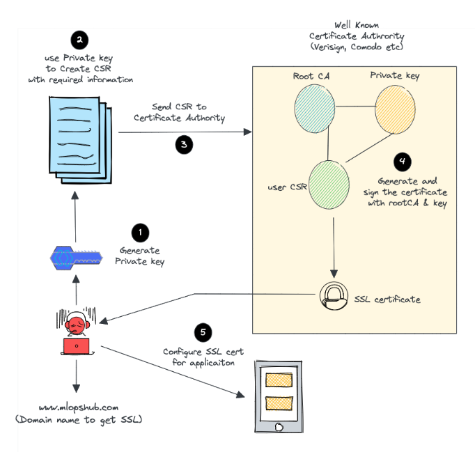

# Paid SSL/TLS Certificate Registration Process

This explain the process of registering a paid SSL/TLS certificate. Overview, the process include some step:

1. Choosing a Certificate Authority (CA)
2. Generating a Certificate Signing Request (CSR)
3. Submitting the SSL/TLS Certificate
4. CA Generates SSL/TLS Certificate
5. Certificate installation on the Web Server
6. Usage and Renewal

## Choosing a Certificate Authority (CA)

A Certificate Authority (CA) is a trusted third party that issues digital certificates. These certificates are used to verify the identity of websites and other entities on the internet.

When choosing a CA to obtain the SSL/TLS certificate from, it is important to select a reputable and trusted CA. Here are some examples of well-known CAs:

* Let's Encrypt
* DigiCert
* Comodo
* GlobalSign
* GoDaddy

## Generating a Certificate Signing Request (CSR)

### What is Certificate Signing Request (CSR) ?

A CSR is a small data file generated by a web server (e.g., Apache, Nginx) or an application that requires an SSL/TLS certificate.

It contains the following information:

* Your website's public key: This is part of a key pair (public-private) used for encryption. The public key is included in the CSR, and the private key is kept secret on your server.
* Distinguished Name (DN): This includes your organization's details (e.g., name, location), common name (usually your domain name), and other identification information.

The CSR serves as a formal request to a Certificate Authority (CA) to issue an SSL/TLS certificate for your domain.

### How to make a CSR ?

There are two main ways to generate a CSR:

* **Using a web-based tool:** There are a number of online tools that can be used to generate CSRs. These tools are typically easy to use and do not require any technical expertise.
* **Using a command-line tool:** CSRs can also be generated using a command-line tool such as OpenSSL. This method requires more technical expertise, but it gives you more control over the CSR generation process.

**To generate a CSR using a web-based tool:**

1. Go to a website that offers CSR generation services.
2. Enter the required information, such as the domain name, organization name, and country.
3. Click the Generate CSR button.
4. Save the CSR file to a secure location.

**To generate a CSR using a command-line tool:**

1. Open a terminal window.
2. Navigate to the directory where you want to save the CSR file.
3. Run the following command:

```
openssl req -newkey rsa:2048 -keyout privateKey.key -out csr.csr
```

This will generate a new 2048-bit RSA private key and a CSR file. The private key file should be kept secret, as it is used to decrypt the data that is encrypted using the public key. The CSR file can be submitted to a CA to obtain an SSL/TLS certificate.

## Submitting the SSL/TLS Certificate

To submit a CSR to a CA, you will need to follow their instructions. Most CAs have a web-based portal where you can submit your CSR. Some CAs also accept CSRs via email or fax.

Here are the general steps for submitting a CSR to a CA:

1. Log in to your account on the CA's website.
2. Navigate to the page where you can submit CSRs.
3. Enter the required information, such as the CSR text and the domain name for which you are requesting the certificate.
4. Click the Submit button.

## CA Generates SSL/TLS Certificate

When a CA receives your CSR, it performs the following steps to generate the certificate:

### Validation

Before the CA can issue a certificate, it needs to validate the information in the CSR. The level of validation depends on the type of certificate requested:

* **Domain Validation (DV)** : For DV certificates, the CA typically validates only that the applicant has control over the domain. This is often done by sending an email to the domain's WHOIS contact or an email address associated with the domain.
* **Organization Validation (OV)** : OV certificates require more thorough validation. The CA verifies the domain ownership and also checks the applicant's organization details, which may involve verifying legal registration documents.
* **Extended Validation (EV)** : EV certificates undergo the most rigorous validation. The CA conducts extensive checks on the organization's identity, including legal, physical, and operational aspects.

### **Certificate Data Creation**

Once the CA has completed the validation process, it creates the actual SSL/TLS certificate. This certificate data includes:

* **Public Key** : Extracted from the CSR, this is the public half of the key pair. It is used for encrypting data that only the corresponding private key can decrypt.
* **Common Name (CN)** : This is typically the fully qualified domain name (FQDN) for which the certificate is issued (e.g., [www.example.com](http://www.example.com/)).
* **Subject Alternative Names (SANs)** : If the certificate covers multiple domains or subdomains, these are listed in the certificate.
* **Issuer Information** : Information about the CA that issued the certificate.
* **Validity Period** : Specifies when the certificate becomes valid (start date) and when it expires (end date).
* **Digital Signature** : The CA uses its private key to create a digital signature for the certificate data. This signature ensures the certificate's authenticity and integrity.

### **Certificate Issuance**

After creating the certificate data and signing it with the CA's private key, the CA officially issues the SSL/TLS certificate.

The issued certificate includes all the information mentioned above, including the digital signature.

### **Certificate Delivery**

The CA delivers the issued certificate to the certificate applicant. This is typically done via email or through a secure online portal where the applicant can download the certificate files.

The certificate files may include the certificate itself (in a format like PEM or DER), intermediate CA certificates (for chain verification), and sometimes a root CA certificate (to establish trust in the CA).

## Certificate installation on the Web Server

The certificate applicant (you) installs the SSL/TLS certificate on their web server. This involves importing the certificate files into the server's configuration.

The web server is then configured to use the certificate for secure (HTTPS) connections.

## **Usage and Renewal**

Once the certificate is installed, it can be used to secure data transmission between the server and clients.

SSL/TLS certificates have a finite validity period, typically 1 to 2 years. The certificate owner is responsible for renewing it before it expires to ensure continued security.



*(Image source: [How To Create Self-Signed Certificates Using OpenSSL (devopscube.com)](https://devopscube.com/create-self-signed-certificates-openssl/))*
