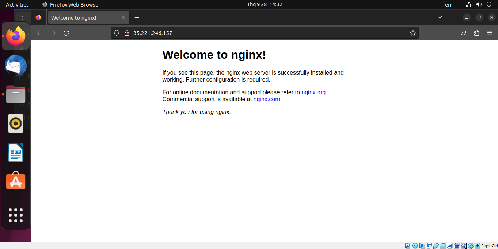
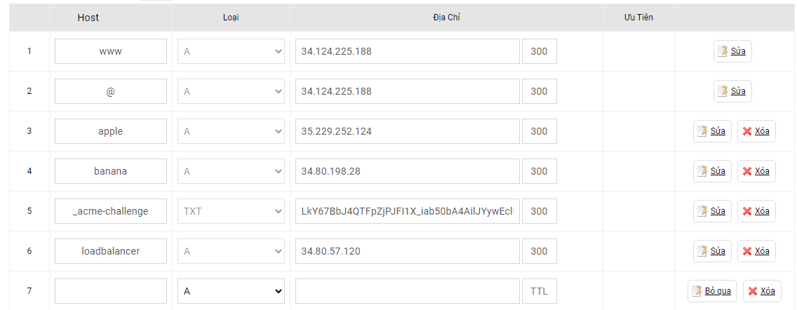
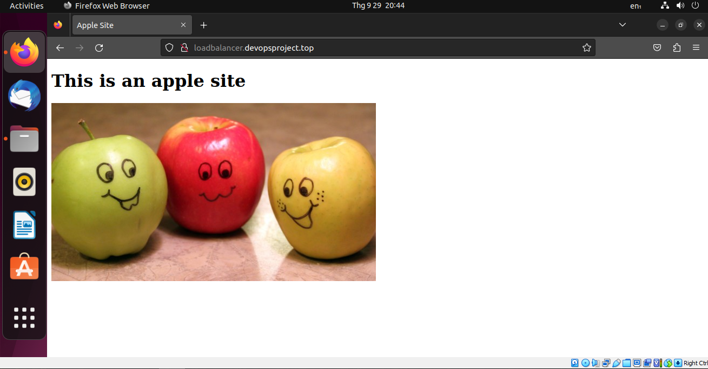
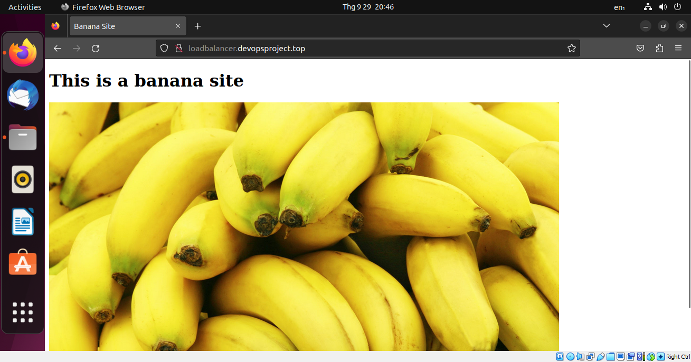

# Setup Load Balancing for Static Website Using Nignx

The main purpose of this project is to learn about Load Balancing, a technique to distribute incoming requests to a group of servers. We will deploy three server in total, two of them will be used for hosting websites and the remaining server will acts as a load balancer. Nginx supports some load balancing algorithms, such as Round Robin, Hash, IP Hash and Least Connections. We will discuss about them in this project.

Here's the key steps of this project:

1. [Deploy three servers](https://github.com/HaiTuyen/Devops-projects-for-self-study/tree/main/Setup%20Load%20Balancing%20for%20Static%20Website%20Using%20Nignx#deploy-three-servers)
2. [Install Nginx on three servers](https://github.com/HaiTuyen/Devops-projects-for-self-study/tree/main/Setup%20Load%20Balancing%20for%20Static%20Website%20Using%20Nignx#install-nginx-on-three-servers)
3. [Set up static websites on two servers using Nginx. Make a small change in the index.html file of one of the websites to differentiate between two servers.](https://github.com/HaiTuyen/Devops-projects-for-self-study/tree/main/Setup%20Load%20Balancing%20for%20Static%20Website%20Using%20Nignx#set-up-static-websites-on-two-servers-using-nginx)
4. [Configure Nginx on the third server to load and balance traffic between two static websites.](https://github.com/HaiTuyen/Devops-projects-for-self-study/tree/main/Setup%20Load%20Balancing%20for%20Static%20Website%20Using%20Nignx#configure-nginx-on-the-third-server-to-load-and-balance-traffic-between-two-static-websites)
5. [Add the Nginx Load balancer IP to the DNS A record.](https://github.com/HaiTuyen/Devops-projects-for-self-study/tree/main/Setup%20Load%20Balancing%20for%20Static%20Website%20Using%20Nignx#add-the-dns-a-record-for-each-server)
6. [Try accessing the website. Every time you reload the website you should see a different index.html.](https://github.com/HaiTuyen/Devops-projects-for-self-study/tree/main/Setup%20Load%20Balancing%20for%20Static%20Website%20Using%20Nignx#try-accessing-the-website)
7. [Choose a load balancing algorithm.](https://github.com/HaiTuyen/Devops-projects-for-self-study/tree/main/Setup%20Load%20Balancing%20for%20Static%20Website%20Using%20Nignx#choose-a-load-balancing-algorithms)

## Deploy three servers

### Create VMs

You can use any cloud service, such as AWS, Google Cloud, or Azure. In this project, I will use Google Cloud.

To deploy three servers, simply create three virtual machines (VMs) and and install an operating system on each one. In this project, I will use **Debian 10** as the operating system.


As you can observe, I have created three server instances named `server-1`, `server-2` and `server-3`, each with its designated purpose:

1. `server-1` and `server-2`: These servers host two distinct websites.
2. `server-3`: It acts as a load balancer, distributing traffic to remain servers.

### SSH into server

To accessing the server, there are several ways:

* using [SSH-in-Browser](https://cloud.google.com/compute/docs/ssh-in-browser) from the Google Cloud console.
* using SSH by running the [`gcloud compute ssh` command](https://cloud.google.com/sdk/gcloud/reference/compute/ssh).
* using SSH from an OpenSSH client (I prefer this way).
* using SSH from the Windows PuTTY app (If your operating system is Window).

Since my computer is currently running Ubuntu (22.04.3 LTS), which supports SSH connections natively, we only need to generate an SSH key pair (public key, private key) with the following command:

```
ssh-keygen -t rsa
```

Keep the private key on your computer and insert the public key into the Virtual machine you created in the previous step.

Now, access the server using the following command:

```
ssh <server_external_IP>
```

During the first-time connection, you might receive a warning, but don't worry; simply type 'yes'. Afterward, you should be able to connect to the server succesfully.

### Configure three servers

To increase the security and usability of your server and make a solid foundation for subsequent actions, you must follow some configuration steps:

**Step 1:** Log in server using SSH protocol:

```
ssh <server_external_IP>
```

**Step 2:** Create a non-root user

```
sudo adduser u1
```

* `u1` is new username I want to create.

> It is highly recommended to create a non-root user when configuring an Debian server, and in fact, it's considered a best practice for security reasons. When you initially set up an Debian server, it often comes with a default user named "root" with full administrative privileges. However, using the root account for everyday tasks can pose security risks.

**Step 3:** Grant administrative privileges to new user

```
sudo usermod -aG sudo u1
```

* `sudo`: This is a command used to execute another command with superuser (root) privileges. It is often required for administrative tasks.
* `usermod`: This is a command used to modify user account properties.
* `-aG sudo`: These are options passed to the `usermod` command:
  * `-a`: It stands for "**append**" and is used to add the user to the specified group without removing them from any other groups.
  * `-G sudo`: This specifies the group to which you want to add the user. In this case, you are adding the user to the "sudo" group.
* `u1`: This is the username of the user you want to add to the "sudo" group.

To display the groups to which an username belongs on a Linux system, use the following command:

```
group <username>
```


As you can see, user 'u3' belongs to the u3 group (created by default) and sudo group (created after executing the previous command)

**Step 4:** Set up basic Firewall

To install UFW firewall software, execute the following commands:

```
sudo apt update
sudo apt install ufw
```

To list all available application profiles, execute the following commands:

```
sudo ufw app list
```

To make sure that the firewall allows SSH connections so that we can log back in next time. We can allow these connections by typing:

```bash
sudo allow OpenSSH
```

Then, we need to enable the firewall:

```
sudo ufw enable
```

To see all allowed SSH connections, run the following command:

```
sudo ufw status
```

To avoid the need to switch users every ssh connect session, it is advisable to access the server directly as a new user intead of root. Please follow these commands (Using SSH keys methods for accessing) to achive this:

```
# Copy entire .ssh directory (include default public key file) of default account to new user home's directory  
sudo cp -r ~/.ssh /home/u1
# Change ownership of that directory (and everything inside it) to the specified username:groupname
sudo chown -R u1:u1 /home/u1/.ssh
```

Now, you can open up a new ternimal session and log in via SSH with your new user

```
ssh <new_username>@<server_external_IP>
```


Execute these steps for each server, you will have completed this part. 💪💪💪

## Install Nginx on three servers.

**First** update your local package lists:

```bash
sudo apt update
```

> This command is used to update the package lists on a Debian-based Linux system. This command does not upgrade the installed packages but rather retrieves the latest information about available packages from the software repositories configured on your system

**Second**, install the `nginx` package:

```bash
sudo apt install nginx
```

**Third**, adjust the firewall:

```
sudo ufw allow 'Nginx Full'
```

> This command is used to configure the Uncomplicated Firewall (UFW) on a Linux system to allow incoming network traffic on a specific port and protocol associated with the "Nginx Full" profile.

**Finally**, check the status of Nginx web server

```
systemctl status nginx
```

> This  command is used to check the status of the Nginx web server on a Linux system using the `systemd` init system.

Now, open a browser the external IP address of your servers, the result should be like this:



Execute these steps for each server, you will have completed this part. 💪💪💪

## Set up static websites on two servers using Nginx

SSH to server 1 and server 2 respectly, then execute the following commands:

* Change the ownership of the `/var/www/html/` directory into the user `u1` and the group `u1`:

  ```
  sudo chown u1:u1 /var/www/html/
  ```
* Gives read, write, and execute permissions to everyone (the owner, group, and others):

  ```
  sudo chmod 777 /var/www/html/
  ```
* Transfer website files into Nginx website directories using SCP protocol:

  ```
  scp -r /home/haituyen/apple_website_files/* u1@35.229.252.124:/var/www/html/
  ```
* Edit the default server block to serve the domain: `apple.devopsproject.top`

  ```
  server {
          listen 80 default_server;
          listen [::]:80 default_server;
  	root /var/www/html;
          index index.html index.htm index.nginx-debian.html;
          server_name apple.devopsproject.top;
          location / {
                  try_files $uri $uri/ =404;
          }
  }
  ```
* Check for syntax errors in Nginx configuration and reload nginx:

  ```
  sudo nginx -t
  sudo systemctl reload nginx
  ```

## Configure Nginx on the third server to load and balance traffic between two static websites.

Open the Nginx configuration files:

```
sudo nano /etc/nginx/nginx.conf
```

Find the `http` block in your Nginx configuration file and add the following code into that block:

```
upstream backend {
	server apple.devopsproject.top;
	server banana.devopsproject.top;
}
server {
	listen 80;
	location / {
		proxy_pass http://backend;
	}
}
```

1. **`listen` Directives:**
   * `listen 80 default_server;`: This indicates that the server block is configured to listen on port 80 for IPv4 connections. The `default_server` parameter means that this server block will be used as the default server for any requests that do not match the server_name of other server blocks.
   * `listen [::]:80 default_server;`: Similar to the first `listen` directive, but for IPv6 connections.
2. **`server_name` Directive:**
   * `server_name loadbalancer.devopsproject.top;`: Specifies the domain name associated with this server block. In this case, requests coming with the `Host` header set to `loadbalancer.devopsproject.top` will be handled by this server block.
3. **`location` Block:**
   * `location / { ... }`: Defines how Nginx should process requests for the specified location (`/` in this case). This block is used for reverse proxying.
   * `proxy_pass http://backend;`: This line instructs Nginx to forward incoming requests to the upstream server group named `backend`. You should have an `upstream` block defined elsewhere in your configuration specifying the servers to which Nginx should distribute the requests.

Remove the symlink of default server block configuration file:

```
sudo rm /etc/nginx/sites-enabled/default
```

Finally, check for syntax errors in the Nginx configuration file and reload Nginx:

```
sudo nginx -t
sudo systemctl reload nginx
```

Because no load‑balancing algorithm is specified in the `upstream` block, NGINX uses the default algorithm, **Round Robin:**

> * When a client makes a request to your Nginx server, the Round Robin algorithm determines which backend server should handle the request.
> * The first request goes to `backend1.example.com`, the second to `backend2.example.com`, the third to `backend3.example.com`, and so on.
> * After reaching the last server, it goes back to the first one, creating a circular sequence.

## Add the DNS A record for each server

Log in to your domain registrar's control panel and add the A record for each server.



## Try accessing the website.

Now, open a web browser and navigate to the load balancer server domain name: `loadbalancer.devopsproject.top`. You should see the following results:

* Result of the first time access :



* Result of the second time access :



* And so on

## Choose a load balancing algorithm

### Round Robin

When no load balancing method is specified in the `upstream` block, Nginx implement Round Robin by default:

```nginx
upstream backend {
	# no load balancing method is specified for Round Robin
	server apple.devopsproject.top;
	server banana.devopsproject.top;
}
```

* ***How does Round Robin algorithm work ?***

  > **Round‑robin load balancing** is one of the simplest methods for distributing client requests across a group of servers. Going down the list of servers in the group, the round‑robin load balancer forwards a client request to each server in turn. When it reaches the end of the list, the load balancer loops back and goes down the list again (sends the next request to the first listed server, the one after that to the second server, and so on).
  >

### Hash

```nginx
upstream backend {
	hash $scheme$request_uri;
	server apple.devopsproject.top;
	server banana.devopsproject.top;
}
```

* ***How does Hash algorithm work ?***

  > With the Hash method, for each request the load balancer calculates a hash that is based on the combination of text and [NGINX variables](https://nginx.org/en/docs/varindex.html) you specify, and associates the hash with one of the servers. It sends all requests with that hash to that server, so this method establishes a basic kind of [session persistence](https://www.nginx.com/products/nginx/load-balancing/#session-persistence).
  > In the above example, the `hash` directive uses the scheme (**http** or  **https** ) and full URI of the request as the basis for the hash
  >

### IP Hash

```nginx
upstream backend {
	ip_hash;
	server apple.devopsproject.top;
	server banana.devopsproject.top;
}
```

* ***What is IP Hash ?***

  > IP Hash (available for HTTP only) is a predefined variant of the Hash method, in which the hash is based on the clients IP address. You set it with the `ip_hash` directive.
  >
  > If the client has an IPv6 address, the hash is based on the entire address. If it has an IPv4 address, the hash is based on just the first three octets of the address. This is designed to optimize for ISP clients that are assigned IP addresses dynamically from a subnetwork (/24) range. In case of reboot or reconnection, the clients address often changes to a different one in the /24 network range, but the connection still represents the same client, so there’s no reason to change the mapping to the server.
  >
  > If, however, the majority of the traffic to your site is coming from clients on the same /24 network, IP Hash doesnt make sense because it maps all clients to the same server. In that case (or if you want to hash on all four octets for another reason), instead use the Hash method with the `$remote_addr` variable.
  >
  > ```
  > hash $remote_addr;
  > ```
  >

### Least Connections

Using the `least_conn` directive to use this algorithm:

```nginx
upstream backend {
	least_conn;
	server apple.devopsproject.top;
	server banana.devopsproject.top;
}
```

* ***How does Least Connections algorithm work ?***
  > With the Least Connections method, the load balancer compares the current number of active connections it has to each server, and sends the request to the server with the fewest connections
  >

To understand more about load balancing technique in Nginx, read this article: [Choosing an NGINX Plus Load‑Balancing Technique - NGINX](https://www.nginx.com/blog/choosing-nginx-plus-load-balancing-techniques/#Pros-Cons-and-Use-Cases)

## Conclusion

Thank you for considering my project, and I hope it proves to be a valuable asset for your needs.

Happy coding and happy building! 👻👻👻
