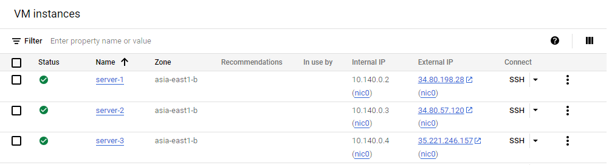
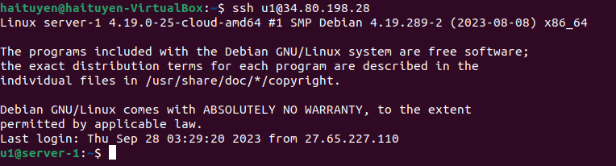

# Setup Load Balancing for Static Website Using Nignx

List of steps: 

1. Deploy three servers
2. Set up static websites on two servers using Nginx. Make a small change in the index.html file of one of the websites to differentiate between two servers.
3. Set up Nginx on the third server. It will act as a load balancer.
4. Configure Nginx to load and balance traffic between two static websites.
5. Add the Nginx Load balancer IP to the DNS A record.
6. Try accessing the website. Every time you reload the website you should see a different index.html.
7. Try different Nginx load-balancing algorithms and options.
8. Understand L7 load balancing.

## Deploy three servers

### Create VMs 

You can use any cloud service, such as AWS, Google Cloud, or Azure. In this project, I will use Google Cloud.

To deploy three servers, simply create three virtual machines (VMs) and and install an operating system on each one. In this project, I will use **Debian 10** as the operating system.



As you can observe, I have created three server instances named `server-1`, `server-2` and `server-3`, each with its designated purpose:

1. `server-1` and `server-2`: These servers host two distinct websites.
2. `server-3`: It acts as a load balancer, distributing traffic to remain servers.

### SSH into server

To accessing the server, there are several ways:

* using [SSH-in-Browser](https://cloud.google.com/compute/docs/ssh-in-browser) from the Google Cloud console.
* using SSH by running the [`gcloud compute ssh` command](https://cloud.google.com/sdk/gcloud/reference/compute/ssh).
* using SSH from an OpenSSH client (I prefer this way).
* using SSH from the Windows PuTTY app (If your operating system is Window).

Since my computer is currently running Ubuntu (22.04.3 LTS), which supports SSH connections natively, we only need to generate an SSH key pair (public key, private key) with the following command:

```
ssh-keygen -t rsa
```

Keep the private key on your computer and insert the public key into the Virtual machine you created in the previous step.

Now, access the server using the following command:

```
ssh <server_external_IP>
```

During the first-time connection, you might receive a warning, but don't worry; simply type 'yes'. Afterward, you should be able to connect to the server succesfully.

### Configure three servers

To increase the security and usability of your server and make a solid foundation for subsequent actions, you must follow some configuration steps: 

**Step 1:** Log in server using SSH protocol:

```
ssh <server_external_IP>
```

**Step 2:** Create a non-root user

```
sudo adduser u1
```

* `u1` is new username I want to create.

> It is highly recommended to create a non-root user when configuring an Debian server, and in fact, it's considered a best practice for security reasons. When you initially set up an Debian server, it often comes with a default user named "root" with full administrative privileges. However, using the root account for everyday tasks can pose security risks.

**Step 3:** Grant administrative privileges to new user

```
sudo usermod -aG sudo u1
```

**Step 4:** Set up basic Firewall

To install UFW firewall software, execute the following commands: 

```
sudo apt update
sudo apt install ufw
```

To list all available application profiles, execute the following commands: 

```
sudo ufw app list
```

To make sure that the firewall allows SSH connections so that we can log back in next time. We can allow these connections by typing:

```bash
sudo allow OpenSSH
```

Then, we need to enable the firewall: 

```
sudo ufw enable
```

To see all allowed SSH connections, run the following command:

```
sudo ufw status
```

Currently, when I access to the server using `ssh <external ip>` command, I logged in to the default account created by Google Cloud. To simplify the process and avoid the need to switch users, it is advisable to access the server directly as a new user. To achive this, please follow these commands (Using SSH keys methods for accessing):

```
# Copy entire .ssh directory (include default public key file) of default account to new user home's directory  
sudo cp -r ~/.ssh /home/<username>
# Change ownership of that directory (and everything inside it) to the specified username:groupname
sudo chown -R sammy:sammy /home/sammy/.ssh
```

Now, you can open up a new ternimal session and log in via SSH with your new user

```
ssh <new_username>@<server_external_IP>
```



Execute these steps for each server, you will have completed this part. 💪💪💪

## Set up static websites on two servers using Nginx. Make a small change in the index.html file of one of the websites to differentiate between two servers
