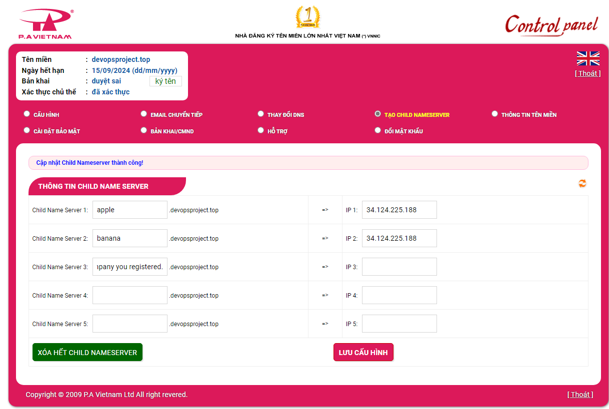

# Setup Multiple Static Websites on a Single Server Using Nginx Virtual Hosts

Nginx web server can host multiple websites on a single server using its server blocks feature.

The main purpose of this project is to make two websites with two subdomains of the `devopsproject.top` domain name and host both of them in the server that we created in "**Setup A Static Website Using Nginx**" project. Here is the list of steps:

1. Create two subdomains
2. Host two website on a single server using Nginx server blocks
3. Add the IP of the server as A record to the two subdomains.
4. Validate the setup accessing the subdomains.
5. Create a wildcard Letsencrypt SSL certificate for the root Domain.
6. Configure wildcard SSL on Nginx for two websites.
7. Validate the subdomain websites’ SSL using OpenSSL utility.

In this project, I assume that you have completed the "**Setup A Static Website Using Nginx**" project. Before proceeding with the following steps, please make sure that you have read all of the steps for setting up Ubuntu server and Nginx web server, including creating a virtual machine, installing Ubuntu Server, configuring both server and firewall, installing Nginx, and configuring Nginx.

Now, let's dive into this project! 🔥🔥🔥

## Create two subdomains

Follow these steps to complete this part: 

* Log in to your domain registrar's control panel.
* Navigate to the DNS settings for your domain.
* Create two subdomains and point them to your server's IP address.



Here, I created two subdomains: `apple.devopsproject.top` and `banana.devopsproject.top`

## Host two website on a single server using Nginx server blocks

### Create two website directories with different content

By default, all website directories are stored in `/var/www/` . To create new website directories, execute the following commands:

```
cd /var/www/
sudo mkdir -p apple.devopsproject.top/html
sudo mkdir -p banana.devopsproject.top/html
```

* The `-p` option ensures that it creates any necessary parent directories if they don't already exist.

### Create two configuration files

By default, the configuration files are stored in `/etc/nginx/sites-available/` directory. To create new configuration files, you only need to copy from the `default` configuration file.

```
sudo cp /etc/nginx/sites-available/default /etc/nginx/sites-available/apple.devopsproject.top
sudo cp /etc/nginx/sites-available/default /etc/nginx/sites-available/banana.devopsproject.top
```

After that, copy the content of `apple.devopsproject.top` file and `banana.devopsproject.top` file in this project directory into each new configuration file respectively using `nano` editor.

```
sudo nano /etc/nginx/sites-available/apple.devopsproject.top
sudo nano /etc/nginx/sites-available/banana.devopsproject.top
```

### Create symlinks (symbolic link) of new configuration files and store it in the `/etc/nginx/sites-enabled` directory

To create symliks of newconfiguration files, execute the following commands:

```
sudo ln -s /etc/nginx/sites-available/apple.devopsproject.top /etc/nginx/sites-enabled/
sudo ln -s /etc/nginx/sites-available/banana.devopsproject.top /etc/nginx/sites-enabled/
```

### Adjust the ownership and file permissions of new website directories

In order to transfer websites file from the client machine to website directories on the server, you must change the ownership and file permissions of those directories to the username that you will use in `scp` command

```
// Change ownership of new website directories to the non-root user
sudo chown dylan1:dylan1 /var/www/apple.devopsproject.top/html/
sudo chown dylan1:dylan1 /var/www/banana.devopsproject.top/html/

// Change files permission of new website directories
sudo chmod 777 /var/www/apple.devopsproject.top/html/
sudo chmod 777 /var/www/banana.devopsproject.top/html/
```

### Transfering website files into new website directories using SCP

Before executing the following commands, you must exit your current ssh connection with the server.

```
scp -r /home/haituyen/apple_website_files/* dylan1@devopsproject.top:/var/www/apple.devopsproject.top/html/
scp -r /home/haituyen/banana_website_files/* dylan1@devopsproject.top:/var/www/banana.devopsproject.top/html/
```

After that, check nginx configuration file for any syntax errors and reload the nginx service. Execute the following command to do that:

```
sudo nginx -t
sudo systemctl reload nginx
```
