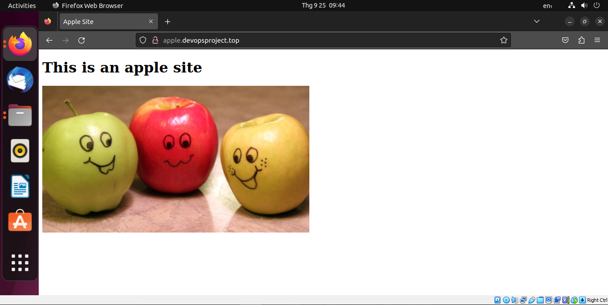
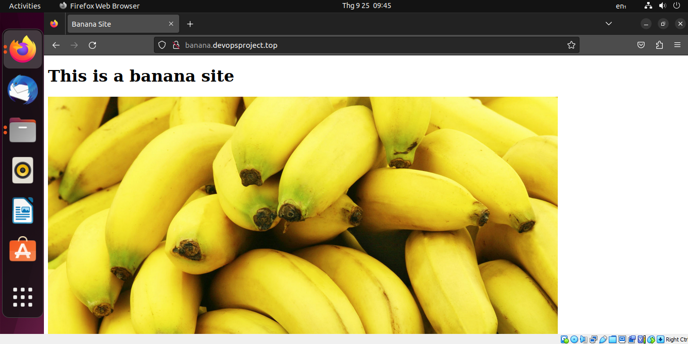
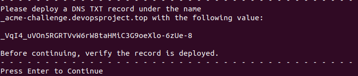
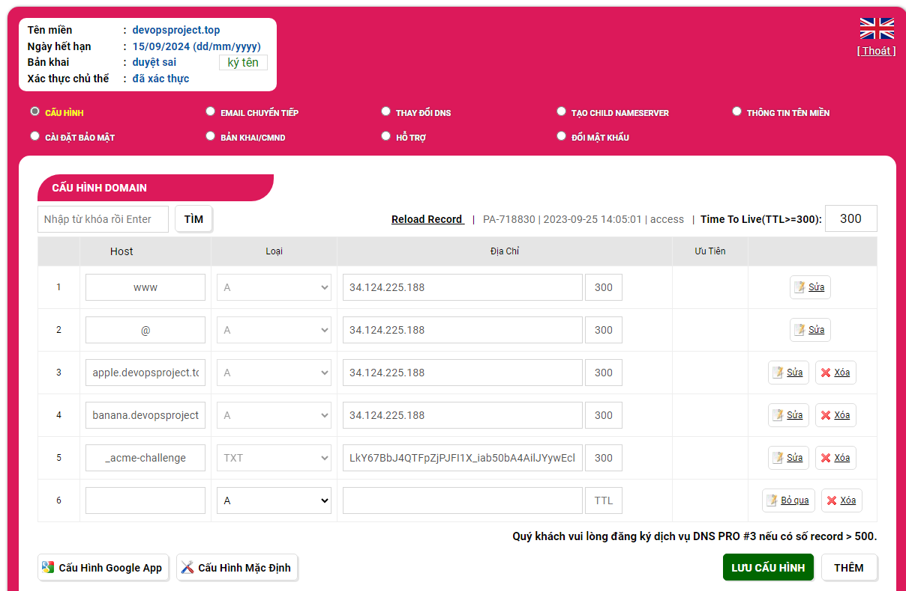
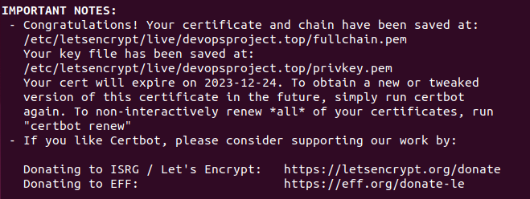
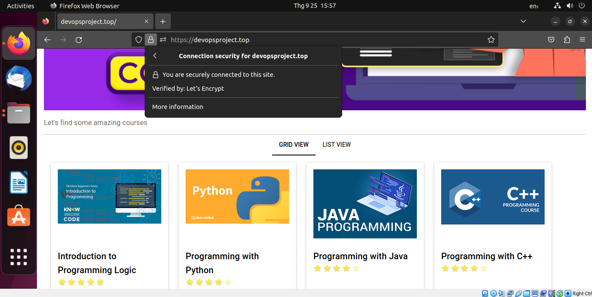
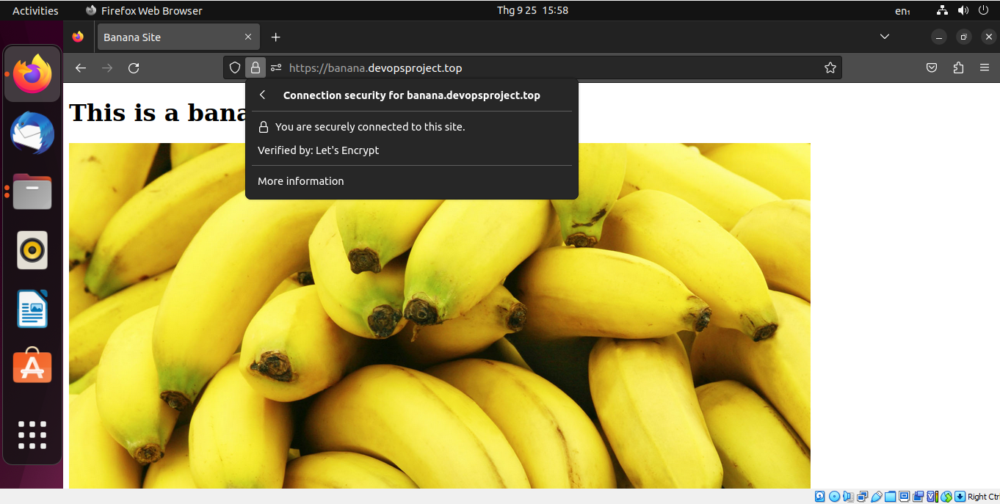

# Setup Multiple Static Websites on a Single Server Using Nginx Virtual Hosts

Nginx web server can host multiple websites on a single server using its server blocks feature.

The main purpose of this project is to make two websites with two subdomains of the `devopsproject.top` domain name and host both of them in the server that we created in "**Setup A Static Website Using Nginx**" project. Here is the list of steps:

1. Create two subdomains
2. Host two website on a single server using Nginx server blocks
3. Validate the setup accessing the subdomains.
4. Create a wildcard Letsencrypt SSL certificate for the root Domain and onfigure wildcard SSL on Nginx for two websites.

In this project, I assume that you have completed the "**Setup A Static Website Using Nginx**" project. Before proceeding with the following steps, please make sure that you have read all of the steps for setting up Ubuntu server and Nginx web server, including creating a virtual machine, installing Ubuntu Server, configuring both server and firewall, installing Nginx, and configuring Nginx.

Now, let's dive into this project! 🔥🔥🔥

## Create two subdomains

Follow these steps to complete this part:

* Log in to your domain registrar's control panel.
* Navigate to the DNS settings for your domain.
* Create two subdomains and point them to your server's IP address.


Here, I created two subdomains: `apple.devopsproject.top` and `banana.devopsproject.top`

## Host two website on a single server using Nginx server blocks

### Create two website directories with different content

By default, all website directories are stored in `/var/www/` . To create new website directories, execute the following commands:

```
cd /var/www/
sudo mkdir -p apple.devopsproject.top/html
sudo mkdir -p banana.devopsproject.top/html
```

* The `-p` option ensures that it creates any necessary parent directories if they don't already exist.

### Create two configuration files

By default, the configuration files are stored in `/etc/nginx/sites-available/` directory. To create new configuration files, you only need to copy from the `default` configuration file.

```
sudo cp /etc/nginx/sites-available/default /etc/nginx/sites-available/apple.devopsproject.top
sudo cp /etc/nginx/sites-available/default /etc/nginx/sites-available/banana.devopsproject.top
```

After that, copy the content of `apple.devopsproject.top` file and `banana.devopsproject.top` file in this project directory into each new configuration file respectively using `nano` editor.

```
sudo nano /etc/nginx/sites-available/apple.devopsproject.top
sudo nano /etc/nginx/sites-available/banana.devopsproject.top
```

### Create symlinks (symbolic link) of new configuration files and store it in the `/etc/nginx/sites-enabled` directory

To create symliks of newconfiguration files, execute the following commands:

```
sudo ln -s /etc/nginx/sites-available/apple.devopsproject.top /etc/nginx/sites-enabled/
sudo ln -s /etc/nginx/sites-available/banana.devopsproject.top /etc/nginx/sites-enabled/
```

### Adjust the ownership and file permissions of new website directories

In order to transfer websites file from the client machine to website directories on the server, you must change the ownership and file permissions of those directories to the username that you will use in `scp` command

```
// Change ownership of new website directories to the non-root user
sudo chown dylan1:dylan1 /var/www/apple.devopsproject.top/html/
sudo chown dylan1:dylan1 /var/www/banana.devopsproject.top/html/

// Change files permission of new website directories
sudo chmod 777 /var/www/apple.devopsproject.top/html/
sudo chmod 777 /var/www/banana.devopsproject.top/html/
```

### Transfering website files into new website directories using SCP

Before executing the following commands, you must exit your current ssh connection with the server.

```
scp -r /home/haituyen/apple_website_files/* dylan1@devopsproject.top:/var/www/apple.devopsproject.top/html/
scp -r /home/haituyen/banana_website_files/* dylan1@devopsproject.top:/var/www/banana.devopsproject.top/html/
```

After that, check nginx configuration file for any syntax errors and reload the nginx service. Execute the following command to do that:

```
sudo nginx -t
sudo systemctl reload nginx
```

## Validate the setup accessing the subdomains.

Up to this point, everything should be okay. Let's open a browser and visit the two websites that you set up in the previous steps.





Currently, our two websites are accessible on the internet.

Nevertheless, they continue to ultilize the HTTP protocol for communication, which lacks security measures. Therefore, the forthcoming step involves implementing the HTTPS protocol.

## Create a wildcard Letsencrypt SSL certificate for the root Domain and configure the Nginx configuration files of all websites.

### What is a wildcard ?

According to [certbot.eff.org](https://certbot.eff.org/),

> A wildcard certificate is a certificate that includes one or more names starting with `*.`. Browsers will accept any label in place of the asterisk (`*`). For example, a certificate for `*.example.com` will be valid for `www.example.com`, `mail.example.com`, `hello.example.com`, and `goodbye.example.com`.
>
> However, a wildcard certificate including *only* the name `*.example.com` will **not** be valid for `example.com`: the substituted label can not be empty. If you want the certificate to be valid for `example.com`, you also need to include `example.com` (i.e. without the `*.` part) on the certificate.
>
> Additionally, the asterisk can only be substituted by a *single* label and not by *multiple* labels. For example, the name `hello.goodbye.example.com` will not be covered by a certificate including only the name `*.example.com`. It *will* be covered however, by `*.goodbye.example.com`. Note that a wildcard name can not contain multiple asterisks. For example, `*.*.example.com` is not valid.

### Remove certbot-auto and any Certbot OS packages installed before

Certbot can be installed using OS packages manager like `apt`, `dnf`, `yum` or `snap` . The exact command to remove them depends on each OS packages manager:

```
sudo apt-get remove certbot
sudo dnf remove certbot
sudo yum remove certbot
sudo snap remove certbot
```

### Install new Certbot

To install Certbot in our Nginx webserver, use the following command:

```
sudo apt install certbot python3-certbot-nginx
```

* `apt`: This is the package management tool for Ubuntu and Debian-based Linux distributions. It is used to install, upgrade, and manage software packages.
* `install`: This is the subcommand for `apt` that instructs it to install the specified packages.
* `certbot`: This is the main Certbot package, which is used for managing Let's Encrypt SSL certificates.
* `python3-certbot-nginx`: This is the Certbot plugin for Nginx. It integrates Certbot with the Nginx web server, making it easier to obtain and manage SSL certificates for Nginx-configured websites.

### Create a wildcard Letsencrypt SSL certificate for the root Domain

Run the command as shown below to request SSL/TLS certificate for the root domain `devopsproject.top` and all its subdomains `*.devopsproject.com`

```
sudo certbot certonly --agree-tos --email devopsproject.top@gmail.com --manual --preferred-challenges=dns -d devopsproject.top -d *.devopsproject.top --server https://acme-v02.api.letsencrypt.org/directory
```

Here's what each part of the command does:

* `certbot`: This is the Certbot command-line tool for managing Let's Encrypt certificates.
* `certonly`: This subcommand instructs Certbot to obtain a certificate but not to install or configure it on a web server. It's often used when you want to manually manage certificate installation.
* `--agree-tos`: This flag indicates that you agree to Let's Encrypt's terms of service.
* `--email devopsproject.top@gmail.com`: This flag specifies the email address to associate with the certificate. Let's Encrypt may use this email for important notifications.
* `--manual`: This flag indicates that you want to perform domain verification manually. This is typically used when you need to set up DNS records manually to prove domain ownership.
* `--preferred-challenges=dns`: This flag specifies that you prefer to use DNS-01 challenges for domain verification. This means you'll be asked to create DNS TXT records to prove domain ownership.
* `-d devopsproject.top -d *.devopsproject.top`: These options specify the domains for which you want to obtain the SSL certificate. In this case, you are requesting a certificate for `devopsproject.top` and all its subdomains (wildcard certificate with `*.devopsproject.top`).
* `--server https://acme-v02.api.letsencrypt.org/directory`: This flag specifies the Let's Encrypt ACME server URL. `https://acme-v02.api.letsencrypt.org/directory` is the URL for the ACME v2 endpoint, which is used for certificate issuance.

When you run this command, Certbot will guide you through the process of obtaining the certificate. You will be asked to verify the ownership of the domain name with DNS-01 chanllenges like this:



To complete the domain verification process, you need to add an record to the configuration site of your domain name.



Before pressing Enter, it's very important to confirm the deployment of the new record. Try to open Window PowerShell and execute the following command:

```
nslookup -q=txt _acme-challenge.devopsproject.top.
```

If you receive the exactly text you previously added, the new record has indeed been successfully deployed. Congratulations! Press the Enter key and you should get feedback as below:



### Configure the Nginx configuration files of all websites

Open the configuration files of all websites using `nano` editor:

```
sudo nano /etc/nginx/sites-available/devopsproject.top
sudo nano /etc/nginx/sites-available/apple.devopsproject.top
sudo nano /etc/nginx/sites-available/banana.devopsproject.top
```

For each configuration file, copy the content of following files in this project directory and paste into it: `apple.devopsproject_SSL.top` , `banana.devopsproject_SSL.top`, `devopsproject_SSL.top`

### Test the Nginx configuration and reload Nginx service

Execute the following command to do this:

```
sudo nginx -t
sudo systemctl reload nginx
```

Until this point, our websites had SSL/TLS certificate already.

Let's open a browser and enter the root domain name first, then the two subdomain names:






## Key Knowledge

1. What is subdomain ?


## Conclusion

To learn more about how SSL/TLS certificates work in the context of security, please visit [this page](https://dev.to/techschoolguru/a-complete-overview-of-ssl-tls-and-its-cryptographic-system-36pd). They will provide you with a very detailed explanation

Thank you for considering my project, and I hope it proves to be a valuable asset for your needs.

Happy coding and happy building! 👻👻👻
